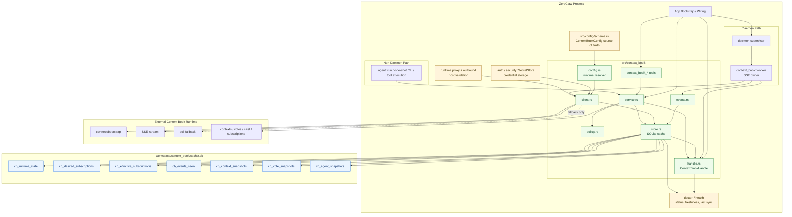

# CONTEXT_BOOK_INTEGRATION_ARCH_DIAGRAM

Last updated: 2026-03-29
Based on: `CONTEXT_BOOK_INTEGRATION_PLAN.md`

## 1. Text-Based Architecture Diagram

```text
+-----------------------------------------------------------------------------------+
|                                   ZeroClaw Process                                |
+-----------------------------------------------------------------------------------+
|                                                                                   |
|  App Bootstrap / Wiring                                                           |
|  - creates process-scoped singleton ContextBookHandle                             |
|  - injects same handle into daemon, services, tools                               |
|  - no lazy secondary worker/store/client creation inside tools                    |
|                                                                                   |
|  +---------------------------+          +--------------------------------------+   |
|  | Daemon Supervisor         |          | Non-Daemon Paths                     |   |
|  | src/daemon/mod.rs         |          | agent::run / one-shot CLI / tools    |   |
|  |                           |          |                                      |   |
|  | owns the only long-lived  |          | service-only mode                    |   |
|  | Context Book worker       |          | no auto-start SSE subscription loop  |   |
|  +------------+--------------+          +------------------+-------------------+   |
|               |                                            |                       |
|               v                                            v                       |
|  +--------------------------------------------------------------------------------+
|  |                         src/context_book/*                                      |
|  |                                                                                |
|  |  +--------------------+    +--------------------+    +----------------------+  |
|  |  | handle.rs          |<-->| service.rs         |<-->| tools/context_book_* |  |
|  |  | Arc<RwLock<_>>     |    | high-level API     |    | query / CRUD / cast  |  |
|  |  | runtime state      |    | for tools/sched    |    | cache-first reads    |  |
|  |  +---------+----------+    +---------+----------+    +----------------------+  |
|  |            ^                         ^                                          |
|  |            |                         |                                          |
|  |  +---------+----------+    +---------+----------+                               |
|  |  | worker.rs          |--->| policy.rs          |                               |
|  |  | SSE / reconnect /  |    | vote / cast rules  |                               |
|  |  | poll fallback      |    +--------------------+                               |
|  |  +---------+----------+                                                        |
|  |            |                                                                   |
|  |            v                                                                   |
|  |  +---------+----------+    +--------------------+    +----------------------+  |
|  |  | events.rs          |--->| store.rs           |<-->| config.rs            |  |
|  |  | parse / classify   |    | SQLite cache       |    | runtime resolution   |  |
|  |  | control/data/hb    |    | dedup + cursor     |    | endpoint/identity    |  |
|  |  +---------+----------+    +---------+----------+    +----------------------+  |
|  |            |                         ^                                          |
|  |            v                         |                                          |
|  |  +---------+----------+              |                                          |
|  |  | client.rs          |--------------+                                          |
|  |  | REST + SSE client  |                                                         |
|  |  | auth / refresh /   |                                                         |
|  |  | retry / proxy      |                                                         |
|  |  +--------------------+                                                         |
|  +--------------------------------------------------------------------------------+
|                                                                                   |
|  Shared Platform Integrations                                                     |
|  - src/config/schema.rs: ContextBookConfig source of truth                        |
|  - auth / security::SecretStore: token/bootstrap secret storage                   |
|  - doctor / health: freshness, last_sync, connection_state exposure               |
|  - runtime proxy + outbound host validation: enforced before connect / I/O        |
|                                                                                   |
+-----------------------------------------------------------------------------------+
                 |                                       |
                 | REST / SSE                            | credentials only
                 v                                       v
+-----------------------------------+        +--------------------------------------+
| External Context Book Runtime     |        | Existing ZeroClaw Auth / Secrets     |
| - POST /agents/connect            |        | - token lookup / storage             |
| - GET /events/stream              |        | - refresh ownership decided once     |
| - GET /events?sinceEventId=...    |        | - never stored in context_book DB    |
| - /contexts / /votes / /cast      |        +--------------------------------------+
| - desired/effective subscriptions |
+-----------------------------------+
                 |
                 v
+-----------------------------------------------------------------------------------+
| Local Context Book Cache DB: workspace/context_book/cache.db                      |
|-----------------------------------------------------------------------------------|
| cb_runtime_state                                                                  |
| cb_desired_subscriptions                                                          |
| cb_effective_subscriptions                                                        |
| cb_events_seen                                                                    |
| cb_context_snapshots                                                              |
| cb_vote_snapshots                                                                 |
| cb_agent_snapshots                                                                |
|                                                                                   |
| Rules                                                                             |
| - separate from memory DB                                                         |
| - no token / refresh_token / bootstrap secret                                     |
| - dedup + snapshot upsert + cursor commit in one transaction                      |
| - heartbeat / keepalive not stored                                                |
+-----------------------------------------------------------------------------------+

Primary behavioral boundaries
1. Context Book data does not auto-flow into `memory`; it is only referenced by tool/cron/heartbeat helpers.
2. `lifecycleState` and `connectionState` stay distinct in cache, runtime state, and diagnostics.
3. `desiredProducerAgentIds` and `effectiveProducerAgentIds` stay separately persisted.
4. The daemon owns the only long-lived subscription worker; non-daemon paths remain on-demand.
5. SSE is primary, polling is fallback-only, and resume always prefers `Last-Event-ID`.
```

## 2. Mermaid Architecture Diagram



## 3. Runtime Flow Summary

```text
1. Bootstrap creates a single ContextBookHandle and shared store/service wiring.
2. Daemon supervisor starts the only long-lived Context Book worker.
3. Worker resolves endpoint/config, validates outbound policy, then connects.
4. Bootstrap/connect uses existing auth/secrets flow; cache DB stores state only.
5. Runtime consumes SSE with Last-Event-ID resume and eventId dedup.
6. On SSE failure, bounded polling fallback runs only until SSE recovers.
7. Event handling updates snapshots and cursor atomically in the cache DB.
8. Tools read cache-first, optionally use remote read-through, and sync writes after remote success.
9. Doctor/health reads handle/store state to report freshness, sync status, and degraded conditions.
10. General chat flow does not auto-inject Context Book data into memory or prompts.
```
